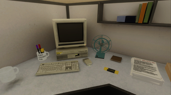
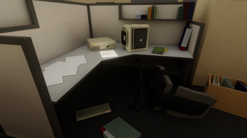
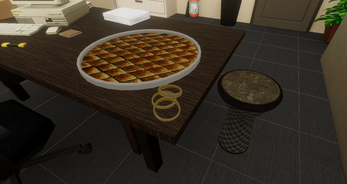

# Gaste Budur

Gaste Budur is a game developed as a team graduation project using Unity and C#.

This repository serves as a portfolio showcase and contains only the scripts that I personally developed for the project. Other team members' source code and project assets are not included.

## Gameplay Video

  

  

## My Contributions

My contributions to the project focused on gameplay systems, UI, and progression mechanics:

- Developed an interactive newspaper editing system where players identify problematic sentences, match them with editorial rules, highlight text, select alternative sentences, and submit edited articles.
- Developed a CV and hiring system where players evaluate candidates, accept or reject applications, and make decisions that affect money and ethics.
- Implemented a mail and notification system that delivers messages based on player actions and progress.
- Developed an achievement system for tracking and displaying achievements throughout the game.
- Implemented money and ethics systems connected to player decisions and hiring.
- Developed an elevator puzzle with room movement, rotation, and triggered transitions.
- Implemented shared events used by different gameplay and UI systems.

## Screenshots

  
  
  

## Technologies

- Unity
- C#

## Source Code

The `Scripts` directory contains the C# scripts I developed for the project, organized by system:

- `AchievementSystem` — achievements and achievement UI
- `Core` — shared events and main UI logic
- `CVSystem` — CV evaluation and hiring
- `Economy` — money and ethics
- `ElevatorPuzzle` — elevator puzzle and room transitions
- `MailSystem` — mail and notifications
- `NewsEditing` — newspaper editing and validation

> **Note:** This repository does not contain the complete Unity project. Some scripts reference systems, components, scene objects, and assets from the original team project that are not included here.
